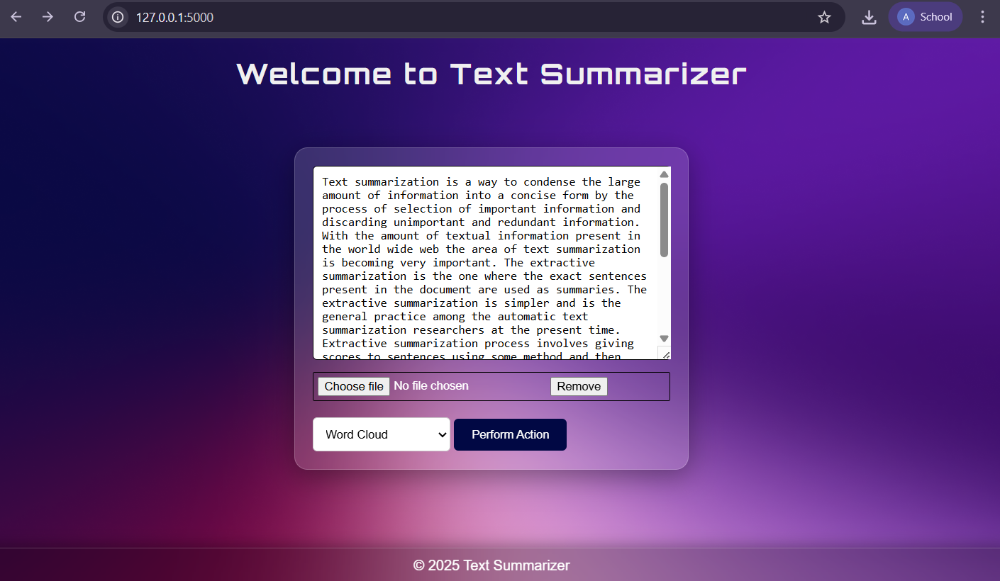
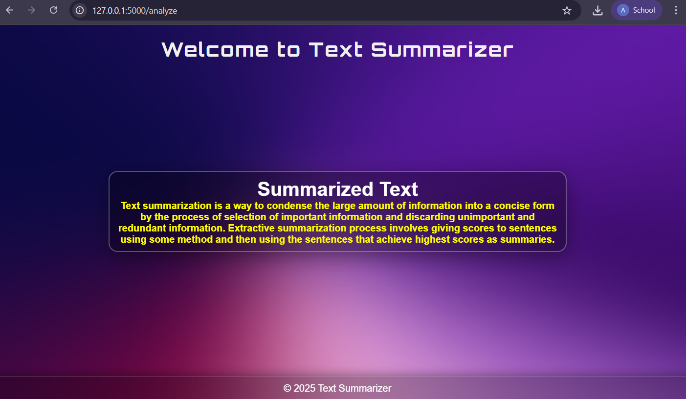
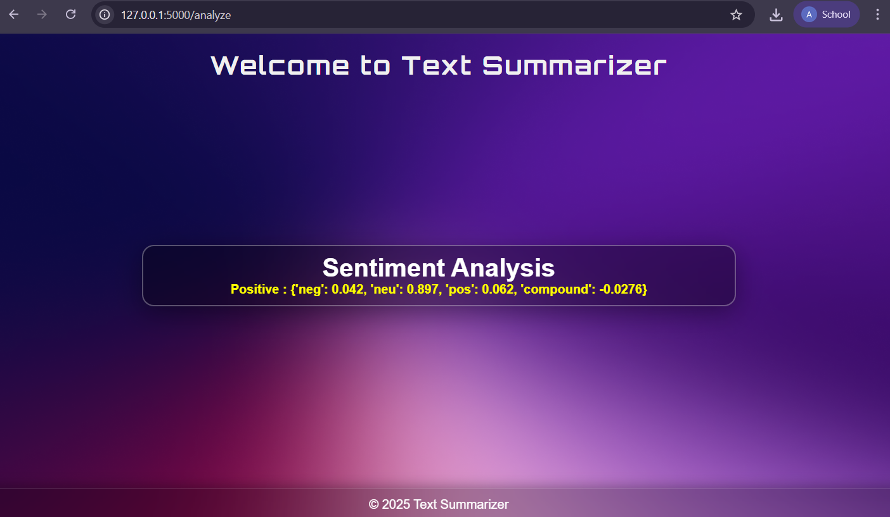
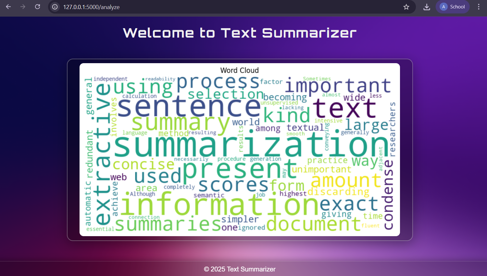

# Text Summarizer - NLP Project

**🚀 [Live Demo](https://text-summarizer-nlp-project-production.up.railway.app/)**

A modern, sleek tool designed to simplify text analysis and document summarization using Natural Language Processing (NLP) techniques. You can quickly generate summaries and gain insights from your documents, making it easier to digest and understand large volumes of text.

## ✨ Features

- **📄 Text Summarization**: Generate concise summaries of your documents, extracting the most important information
- **😊 Sentiment Analysis**: Determine the sentiment expressed in your text, whether it's positive, negative, or neutral
- **📁 Document Management**: Upload and manage PDF documents for easy analysis and summarization
- **☁️ Word Cloud Generation**: Visualize the most frequently occurring words in your text for a quick overview
- **🎨 Modern UI**: Beautiful glass morphism design with translucent backgrounds
- **📱 Responsive Design**: Works seamlessly across different screen sizes

## 🛠️ Technologies Used

- **Backend**: Flask (Python web framework)
- **NLP Libraries**: NLTK, TextBlob, Spacy
- **Data Processing**: NumPy, Scikit-Learn
- **PDF Processing**: PyPDF2
- **Visualization**: Matplotlib, WordCloud
- **Frontend**: HTML5, CSS3 with Glass Morphism design

## 📋 Requirements

- **Python**: 3.10 - 3.12
- **Dependencies**: Listed in `requirements.txt`

## 🚀 Installation & Setup

1. **Clone the repository**
   ```bash
   git clone https://github.com/akshatkmistry/Text-Summarizer---NLP-Project.git
   cd Text-Summarization-NLP
   ```

2. **Create virtual environment**
   ```bash
   python -m venv .venv
   source .venv/bin/activate  # On Windows: .venv\Scripts\activate
   ```

3. **Install dependencies**
   ```bash
   pip install -r requirements.txt
   ```

4. **Download NLTK data**
   ```python
   python -c "import nltk; nltk.download('punkt'); nltk.download('stopwords'); nltk.download('vader_lexicon')"
   ```

5. **Run the application**
   ```bash
   python app.py
   ```

6. **Open your browser** and navigate to `http://127.0.0.1:5000`

## 📖 Usage

1. **Text Summarization**: Paste your text or upload a PDF document, select "Summarize Text" and click "Perform Action"
2. **Sentiment Analysis**: Enter your text, select "Sentiment Analysis" to get emotional insights
3. **Word Cloud Generation**: Create visual word clouds to see the most frequent terms in your text

## 📸 Screenshots

### 🏠 Home Page


### 📄 Text Summarization


### 😊 Sentiment Analysis


### ☁️ Word Cloud


## 🤝 Contributing
🚀 Feel free to fork the repository and submit pull requests! Contributions are welcome.

## 📧 Contact
For any queries, reach out via GitHub Issues or email at:
✉️ akshatkmistry007@gmail.com